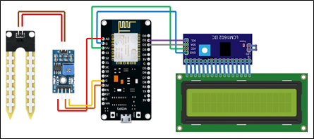

# Soil Moisture Monitoring using YL-69 Soil Moisture Sensor

This project implements soil moisture monitoring using the YL-69 soil moisture sensor and the Blynk platform. It utilizes the NodeMCU ESP8266 LoLin as the microcontroller and displays soil moisture data on Blynk and a 16x2 LCD screen using the I2C module.

## Tools and Materials
- Software:
  - Arduino IDE
  - Blynk (legacy)
- Hardware:
  - NodeMCU ESP8266 LoLin
  - YL-69 Soil Moisture Sensor
  - Hitachi HD44780 LCD 16x2 controller with I2C Module
  - 9 Female-to-Female Jumper Wires
  - Micro USB Cable
  - Power Bank
  - Android Smartphone

## Prerequisites
Before using this project, make sure you have met the following prerequisites:
- Installed the ESP8266 board in the Arduino IDE.
- Installed the Blynk library in the Arduino IDE.
- Installed the WiFiManager library in the Arduino IDE.
- Installed the I2C library in the Arduino IDE.

## Usage Instructions
For detailed usage instructions, please refer to the [Complete Project Documentation](Project Report.pdf).

Here are the general steps to run the project:
1. Connect NodeMCU, Soil Moisture Sensor, and LCD according to the following wiring scheme:
   - NodeMCU <-> Soil Moisture Sensor
     - Connect the A0 pin of NodeMCU to the AO pin of the Soil Moisture Sensor.
     - Connect the G pin of NodeMCU to the GND pin of the Soil Moisture Sensor.
     - Connect the 3V pin of NodeMCU to the VCC pin of the Soil Moisture Sensor.
   - NodeMCU <-> LCD
     - Connect the G pin of NodeMCU to the GND pin of the I2C LCD.
     - Connect the VU pin of NodeMCU to the VCC pin of the I2C LCD.
     - Connect the D1 pin of NodeMCU to the SCL pin of the I2C LCD.
     - Connect the D2 pin of NodeMCU to the SDA pin of the I2C LCD.

2. Connect the NodeMCU ESP8266 LoLin to the computer using a Micro USB cable.

3. Open the `config.ino` file using the Arduino IDE.

4. Adjust the WiFi Hotspot settings in the `config.ino` file.

5. Open the `Soil_Monitoring_Sensor_BLYNK.ino` file using the Arduino IDE.

6. Verify/compile and upload the sketch to the NodeMCU ESP8266 LoLin.

7. Open the Blynk app, create a new project, and configure the project setup.

8. Obtain the Blynk token from the Blynk app and run the project.

9. Connect a power bank to the NodeMCU to provide power.

10. Connect to the WiFi Hotspot network specified in the `config.ino` file and configure the WiFi and Blynk token.

11. The NodeMCU will connect to the WiFi network, and the soil moisture data will be displayed on the LCD and Blynk.

Please refer to the [Complete Project Documentation](Project Report.pdf) for more information on usage and project configuration.

## License

This project is licensed under the [MIT License](LICENSE). Please see the [LICENSE](LICENSE) file for complete license information.